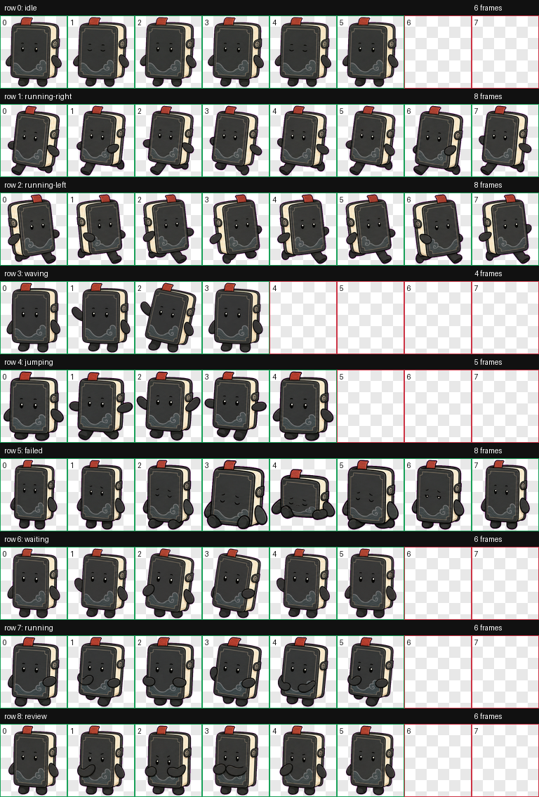

# 守源 Shouyuan

守源是一个 Codex 自定义宠物：一个安静、克制的“真源守门”小笔记本。

它适合放在 Codex 里提醒自己：先看证据，再动手；先守边界，再写代码；先复核，再交付。



## 快速安装

```bash
git clone https://github.com/RonHaiT/codex-pets.git
cd codex-pets
./scripts/install.sh
```

安装后重启 Codex，宠物列表里应能看到 `守源`。

也可以手动安装：

```bash
mkdir -p "$HOME/.codex/pets/shouyuan"
cp pet.json spritesheet.webp "$HOME/.codex/pets/shouyuan/"
```

## 上传到 codex-pets.net

打开 [codex-pets.net 上传页](https://codex-pets.net/#/upload)，登录后上传：

- `pet.json`
- `spritesheet.webp`

表单字段建议：

- Kind: `Object`
- Tags: `minimal`, `animated`, `object`, `mascot`, `utility`

详细步骤见 [docs/upload-to-codex-pets.md](docs/upload-to-codex-pets.md)。

## 设计说明

守源不是动物，也不是品牌 logo。它是一本小小的黑色笔记本，带暖色纸边和红色签条，用来表达：

- evidence-first: 先坐实证据
- source-of-truth: 尊重真源
- boundary-aware: 不越过项目边界
- review-ready: 交付前认真复核
- calm by default: 克制，不制造噪音

## 动作状态

| State | Meaning |
| --- | --- |
| `idle` | 安静待命，轻微呼吸和眨眼 |
| `running-right` | 右向拖动移动 |
| `running-left` | 左向拖动移动 |
| `waving` | 友好打招呼 |
| `jumping` | 轻微跳起 |
| `failed` | 阻塞或失败 |
| `waiting` | 等待用户确认 |
| `running` | 正在处理任务 |
| `review` | 专注复核结果 |

## 文件结构

```text
.
├── pet.json
├── spritesheet.webp
├── upload-metadata.json
├── assets/
│   ├── contact-sheet.png
│   └── previews/
├── docs/
│   ├── marketing-copy.md
│   ├── qa.md
│   ├── review.json
│   ├── upload-to-codex-pets.md
│   └── validation.json
└── scripts/
    └── install.sh
```

## QA

The packaged spritesheet is `1536x1872`, RGBA WebP, based on `192x208` cells.

Validation summary:

- `docs/review.json`: no errors, no warnings
- `docs/validation.json`: no errors, no warnings
- transparent RGB residue pixels: `0`

完整说明见 [docs/qa.md](docs/qa.md)。

## License

Use, fork, and adapt this pet for personal Codex setups. If you publish a modified version, rename it so people can distinguish your variant from the original `守源`.
